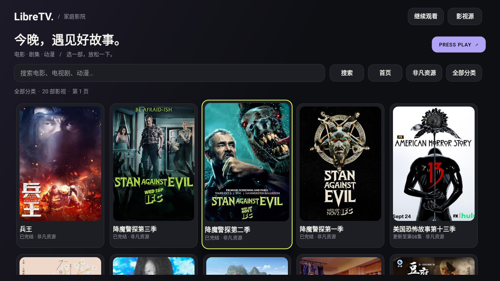
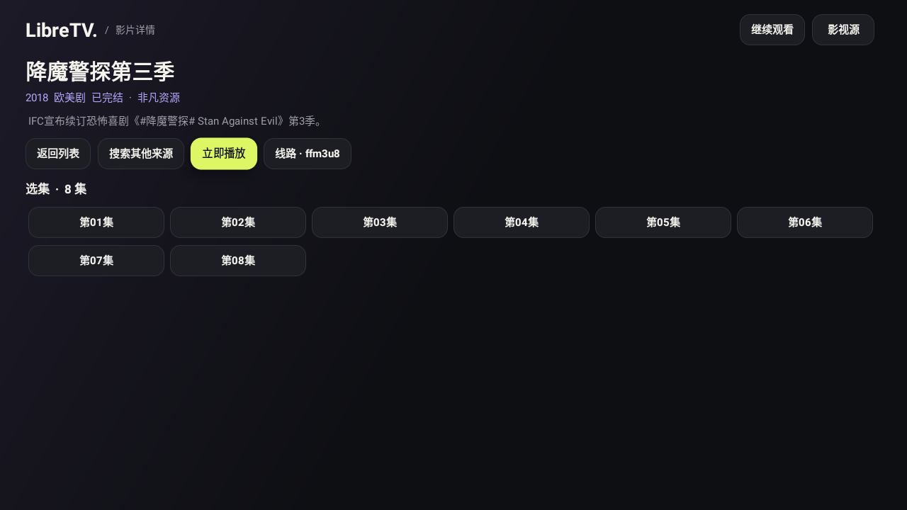

# LibreTV 家庭影院

面向电视与遥控器的原生 Android 影视应用，基于 [LibreSpark/LibreTV](https://github.com/LibreSpark/LibreTV) 的苹果 CMS 采集协议重新实现。适用于小米电视、小米盒子及其他 Android 6.0（API 23）以上设备。

**无需账号或启动密码，无需部署网站、Docker 或应用后端。** 安装 APK 后即可浏览、搜索和播放第三方影视源提供的内容，仍需互联网与可用片源。

[下载 APK](https://github.com/gcdxuzhiwei/LibreTV-Home/releases/latest) · [更新日志](docs/CHANGELOG.md) · [构建与发布](docs/releasing.md) · [验证记录](docs/validation.md)

## 功能

- **电视交互**：横屏布局、大幅海报、清晰焦点，支持遥控器方向键与确认键。
- **浏览与搜索**：按来源、分类浏览，分页加载；同时搜索所有启用来源，同名片源独立展示，便于换源。
- **播放与选集**：支持 HLS、MP4、DASH 等直接媒体线路，选集、切换线路、快进快退和自动播放下一集。
- **继续观看**：保存最近 30 部影片的集数与播放进度，每 5 秒及退出播放器时保存，支持清空记录。
- **影视源管理**：启用、检测、添加和删除苹果 CMS JSON 接口，设置与观看记录保存在本机。

## 界面截图

### 首页

按来源与分类浏览影片，青柠色边框标记当前遥控器焦点。



### 影片详情

查看影片信息，立即播放、选择集数或搜索其他来源。



> 截图来自 1.1 系列的已有验证记录。影片与来源仅作界面展示，实际内容取决于第三方接口。

## 安装

1. 从 [GitHub Releases](https://github.com/gcdxuzhiwei/LibreTV-Home/releases/latest) 的 **Assets** 下载 `LibreTV-Home-<版本号>.apk`。
2. 将 APK 复制到 U 盘并插入电视。
3. 在电视设置中允许文件管理器安装未知来源应用，用文件管理器打开 APK 安装。
4. 在应用列表打开「LibreTV 家庭影院」。不同电视系统的安装入口可能不同。

如果设备支持 ADB 调试，也可安装（将 IP 与文件名替换为实际值）：

```powershell
adb connect 192.168.1.100:5555
adb install -r .\LibreTV-Home-1.1.11.apk
```

当前源码版本为 **1.1.11**，发布附件以 Releases 页面为准。APK 为已签名的 debug 构建，不要求 Google Play 服务，不含原生 CPU 库，适用于 32 / 64 位 ARM 与 x86 设备；安装权限与解码能力仍取决于设备。

**覆盖升级**：从 1.1.6 起使用固定签名，可在签名一致且版本递增时覆盖安装。此前 GitHub 版本的签名不同，需要先卸载再安装一次；卸载会清除本机观看记录与源设置。

## 使用与遥控器

打开应用后，通过来源按钮和「全部分类」浏览影片，在列表底部加载下一页；输入名称并选择「搜索」可搜索所有启用来源。进入详情后选择「立即播放」或指定集数，片源不可用时可切换线路或「搜索其他来源」。

| 场景 | 按键 | 操作 |
| --- | --- | --- |
| 列表 / 详情 | 方向键、确定 | 移动焦点、选择影片或按钮 |
| 列表无焦点 | 任意方向键 | 恢复焦点到「继续观看」 |
| 详情 | 返回 | 回到列表 |
| 列表 | 返回 | 打开退出确认，取消或返回可关闭弹窗 |
| 播放区域 | 左 / 右 | 快退 / 快进 15 秒，控制条隐藏时也可使用 |
| 播放区域 | 确定 | 暂停 / 继续 |
| 播放器 | 上 / 下 | 上键进入顶部按钮，下键回到播放区域 |
| 顶部按钮 | 左 / 右、确定 | 选择并执行选集、切线路、上一集或下一集 |
| 播放器 | 菜单 | 打开选集 |
| 播放器 | 返回 | 控制条显示时先收起，再按一次退出播放器 |

每次进入首页会重新加载第一页：先聚焦「继续观看」，加载完成后聚焦第一部影片；加载期间主动移动焦点会保留选择。顶部播放按钮获得焦点时，控制条保持显示。

## 片源与播放限制

搜索、列表、详情、封面和视频均由设备直接访问第三方来源。应用不保存视频、不提供影视内容，也不依赖远程配置订阅。内置来源可修改，其内容与长期可用性由第三方决定。

- 第三方源可能失效、限流或要求特殊请求头；检测接口可用不代表每部影片都能播放。
- 只支持直接媒体线路，不支持网页解析、TVBox Spider / JAR 脚本或付费平台 DRM。
- 出现 TLS 证书错误时可更换来源，应用保留证书与域名校验。
- 观看记录与源设置仅保存在应用私有存储中，没有远程同步。

实体电视的安装权限、遥控器键值、旧系统证书及硬件解码差异尚未全面验证，已验证场景见 [验证记录](docs/validation.md)。

## 本地构建

使用 Android Studio 打开项目，准备 **JDK 17** 与 **Android SDK 35**，设置 `JAVA_HOME`、`ANDROID_HOME` 或 `local.properties`。构建前需配置固定签名密钥，详见 [发布说明](docs/releasing.md)。

```powershell
.\gradlew.bat assembleDebug lintDebug
```

已准备项目 `.tools` 工具的工作区可直接运行：

```powershell
.\scripts\build.ps1
```

脚本读取构建元数据中的版本号，校验 APK 签名后输出：

```text
dist/LibreTV-Home-1.1.11.apk
dist/SHA256-1.1.11.txt
```

签名密钥放在 `.tools/signing/debug.keystore`，或通过 `LIBRETV_KEYSTORE` 指定路径。仓库只保存公开证书指纹，缺少密钥或证书不匹配时会停止构建。自行分发时需配置自己的密钥及对应指纹，并保持后续版本签名一致。首次构建需要下载 Gradle / Maven 依赖，应用运行无需构建环境。

## 项目结构与发布

```text
app/                 Android 应用源码、资源与模块配置
gradle/wrapper/      Gradle Wrapper
scripts/             本地构建与签名校验脚本
.github/workflows/   GitHub Actions 构建与发布
docs/screenshots/    README 界面截图
docs/                发布说明、更新日志、验证记录与上游参考
signing-certificate.sha256  固定签名的公开证书指纹
LICENSE              项目许可
```

`.tools/`、`.gradle/`、`.idea/`、模块 `build/`、`dist/`、本机 SDK 路径与私有签名密钥不提交到仓库。

GitHub Actions 在推送到 `main` 且应用版本变化时，或在 `main` 上手动运行时构建；构建与 Lint 通过后发布 `v<版本号>` 的正式 GitHub Release，并标记 Latest。首次使用需配置 `ANDROID_DEBUG_KEYSTORE_BASE64`，步骤见 [发布说明](docs/releasing.md#首次配置签名-secret)。

每个 Release 提供 APK 与 SHA-256 校验文件，源码随版本标签保存，由 GitHub 提供 ZIP / tar.gz；无需将每版 APK 提交进 Git。

## 实现与许可

应用使用 Java 原生 Activity / GridLayout / ScrollView，播放器采用 AndroidX Media3 ExoPlayer 1.5.1。`Catalog.java` 将苹果 CMS 请求与 `vod_play_url` 解析迁移到设备端，包含网络超时、响应大小限制和过期请求保护；分类仅展示叶子分类。

未移植上游网站的服务端鉴权、代理、豆瓣推荐和网页播放器。`docs/upstream-cms-parser.ts` 与 `docs/upstream-types.ts` 保留了 2026-10-09 获取的上游参考源码。

本项目遵循 **GNU AGPL-3.0**，详见 [LICENSE](LICENSE)；再分发应用时应一并提供对应版本源码和许可。原 LibreTV 归 LibreSpark / LibreTV 贡献者所有，本项目并非小米或 LibreSpark 官方客户端。Media3 使用 Apache-2.0 许可。
