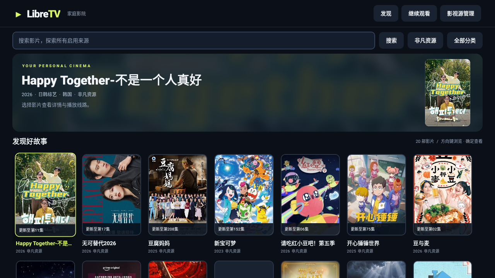
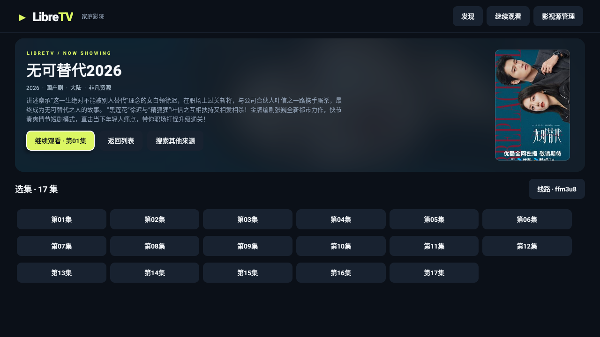

# LibreTV 家庭影院

面向电视与遥控器的 Android 影视应用，使用 React Native TV 界面与原生 Media3 播放器，基于 [LibreSpark/LibreTV](https://github.com/LibreSpark/LibreTV) 的苹果 CMS 采集协议重新实现。最低安装要求为 Android 6.0（API 23）；实体电视兼容性仍需验证。

当前源码为 **1.2.1**，React Native TV 改造的本地验证见 [改造记录](docs/react-native-tv.md)。截图展示当前界面，公开下载版本以 Releases 页面实际附件为准。

**无需账号或启动密码，无需部署网站、Docker 或应用后端。** 安装 APK 后即可浏览、搜索和播放第三方影视源提供的内容，仍需互联网与可用片源。

[下载 APK](https://github.com/gcdxuzhiwei/LibreTV-Home/releases/latest) · [更新日志](docs/CHANGELOG.md) · [构建与发布](docs/releasing.md) · [验证记录](docs/validation.md)

## 功能

- **电视交互**：横屏布局、大幅海报、清晰焦点，支持遥控器方向键与确认键。
- **浏览与搜索**：按来源、分类浏览，分页加载；同时搜索所有启用来源，同名片源独立展示，便于换源。
- **播放与选集**：支持 HLS、MP4、DASH 等直接媒体线路，选集、切换线路、快进快退和自动播放下一集。
- **继续观看**：保存最近 30 部影片的集数与播放进度，每 5 秒及退出播放器时保存，支持清空记录。
- **影视源管理**：启用、检测、添加和删除苹果 CMS JSON 接口，设置与观看记录保存在本机。

## 界面截图

### 首页

按来源与分类浏览影片，青柠色边框标记当前遥控器焦点。



### 影片详情

查看影片信息，立即播放、选择集数或搜索其他来源。



> 截图来自 Android TV API 30 模拟器的 React Native TV 验证。影片与来源仅作界面展示，实际内容取决于第三方接口。

## 安装

1. 从 [GitHub Releases](https://github.com/gcdxuzhiwei/LibreTV-Home/releases/latest) 的 **Assets** 下载 `LibreTV-Home-<版本号>.apk`。
2. 将 APK 复制到 U 盘并插入电视。
3. 在电视设置中允许文件管理器安装未知来源应用，用文件管理器打开 APK 安装。
4. 在应用列表打开「LibreTV 家庭影院」。不同电视系统的安装入口可能不同。

如果设备支持 ADB 调试，也可安装（将 IP 与文件名替换为实际值）：

```powershell
adb connect 192.168.1.100:5555
adb install -r .\LibreTV-Home-1.2.1.apk
```

当前源码版本为 **1.2.1**，发布附件以 Releases 页面为准。APK 为已签名的 debug 构建，不要求 Google Play 服务。React Native TV 试验构建包含 32 / 64 位 ARM 与 x86 的原生库，安装权限与解码能力仍取决于设备。

**覆盖升级**：从 1.1.6 起使用固定签名，可在签名一致且版本递增时覆盖安装。此前 GitHub 版本的签名不同，需要先卸载再安装一次；卸载会清除本机观看记录与源设置。

## 使用与遥控器

打开应用后，通过来源按钮和「全部分类」浏览影片，在列表底部加载下一页；输入名称并选择「搜索」可搜索所有启用来源。进入详情后选择「立即播放」或指定集数，片源不可用时可切换线路或「搜索其他来源」。

| 场景 | 按键 | 操作 |
| --- | --- | --- |
| 列表 / 详情 | 方向键、确定 | 移动焦点、选择影片或按钮 |
| 搜索输入框 | 确定 | 进入文字编辑，提交或选择「搜索」执行查询 |
| 详情 | 返回 | 回到列表 |
| 来源 / 分类 / 线路弹窗 | 返回 | 关闭弹窗 |
| 搜索结果 | 返回 | 清除搜索，回到首页列表 |
| 首页 | 返回 | 打开退出确认 |
| 播放区域 | 左 / 右 | 快退 / 快进 15 秒，控制条隐藏时也可使用 |
| 播放区域 | 确定 | 暂停 / 继续 |
| 播放器 | 上 / 下 | 上键进入顶部按钮，下键回到播放区域 |
| 顶部按钮 | 左 / 右、确定 | 选择并执行选集、切线路、上一集或下一集 |
| 播放器 | 菜单 | 打开选集 |
| 播放器 | 返回 | 控制条显示时先收起，再按一次退出播放器 |

「发现」会清除搜索与分类并重新加载第一页；从详情返回会保留列表。首页首排海报按上键进入搜索输入框。播放器顶部按钮获得焦点时，控制条保持显示。

## 片源与播放限制

搜索、列表、详情、封面和视频均由设备直接访问第三方来源。应用不保存视频、不提供影视内容，也不依赖远程配置订阅。内置来源可修改，其内容与长期可用性由第三方决定。

- 第三方源可能失效、限流或要求特殊请求头；检测接口可用不代表每部影片都能播放。
- 只支持直接媒体线路，不支持网页解析、TVBox Spider / JAR 脚本或付费平台 DRM。
- 出现 TLS 证书错误时可更换来源，应用保留证书与域名校验。
- 观看记录与源设置仅保存在应用私有存储中，没有远程同步。

实体电视的安装权限、遥控器键值、旧系统证书及硬件解码差异尚未全面验证，已验证场景见 [验证记录](docs/validation.md)。

## 本地构建

准备 **Node.js 22、JDK 17、Android SDK 35 与 Build Tools 34.0.0**，设置 `JAVA_HOME`、`ANDROID_HOME` 或 `local.properties`。构建前需配置固定签名密钥，详见 [发布说明](docs/releasing.md)。Android Studio 同步项目之前也需先安装 npm 依赖。

```powershell
npm ci
npm run typecheck
.\gradlew.bat assembleDebug lintDebug
```

已准备项目 `.tools` 工具的工作区可直接运行：

```powershell
.\scripts\build.ps1
```

脚本读取构建元数据中的版本号，校验 APK 签名后输出：

```text
dist/LibreTV-Home-1.2.1.apk
dist/SHA256-1.2.1.txt
```

签名密钥放在 `.tools/signing/debug.keystore`，或通过 `LIBRETV_KEYSTORE` 指定路径。仓库只保存公开证书指纹，缺少密钥或证书不匹配时会停止构建。自行分发时需配置自己的密钥及对应指纹，并保持后续版本签名一致。首次构建需要下载 Gradle / Maven 依赖，应用运行无需构建环境。

## 项目结构与发布

```text
app/                 Android 应用源码、资源与模块配置
src/                 React Native TV 页面与设备端桥接接口
gradle/wrapper/      Gradle Wrapper
scripts/             本地构建与签名校验脚本
.github/workflows/   GitHub Actions 构建与发布
docs/screenshots/    README 界面截图
docs/                发布说明、更新日志与验证记录
signing-certificate.sha256  固定签名的公开证书指纹
LICENSE              项目许可
```

`.tools/`、`.gradle/`、`.idea/`、模块 `build/`、`dist/`、本机 SDK 路径与私有签名密钥不提交到仓库。

GitHub Actions 在推送到 `main` 且应用版本变化时，或在 `main` 上手动运行时构建；构建与 Lint 通过后发布 `v<版本号>` 的正式 GitHub Release，并标记 Latest。首次使用需配置 `ANDROID_DEBUG_KEYSTORE_BASE64`，步骤见 [发布说明](docs/releasing.md#首次配置签名-secret)。

每个 Release 提供 APK 与 SHA-256 校验文件，源码随版本标签保存，由 GitHub 提供 ZIP / tar.gz；无需将每版 APK 提交进 Git。

## 实现与许可

当前界面使用 React 18.3.1 / `react-native-tvos` 0.75.4-0，播放器采用 AndroidX Media3 ExoPlayer 1.5.1。`Catalog.java` 负责苹果 CMS 请求、分类和 `vod_play_url` 解析，`Network.java` 统一网络客户端与错误描述；页面忽略过期请求结果，分类仅展示叶子分类。

### React Native TV 界面

`TvActivity` 为启动入口：首页、搜索、详情、选集和观看记录由 `src/App.tsx` 提供；`SettingsActivity` 管理影视源，`PlayerActivity` 播放视频。CMS 请求与本机数据通过 `LibreTvModule.java` 桥接。JS 与 Hermes 打包在 APK 内，运行时无需 Metro 或网站服务器。旧 Java 浏览页面已移除。

Windows 调试遥控器位于项目根目录 `LibreTV-Remote.exe`，通过 Android Launcher 自动打开应用，兼容旧版原生和新版 React Native TV 入口。修改 `scripts/RemoteDebug.cs` 后运行 `./scripts/build-remote.ps1` 重新生成 EXE。

固定旧版 React Native TV 是为了保留 API 23 的最低安装范围；工具链依赖审计与设备验证限制见 [React Native TV 改造](docs/react-native-tv.md)。

未移植上游网站的服务端鉴权、代理、豆瓣推荐和网页播放器。设备端协议实现以 `Catalog.java` 为准。

本项目遵循 **GNU AGPL-3.0**，详见 [LICENSE](LICENSE)；再分发应用时应一并提供对应版本源码和许可。原 LibreTV 归 LibreSpark / LibreTV 贡献者所有，本项目并非小米或 LibreSpark 官方客户端。Media3 使用 Apache-2.0 许可。
